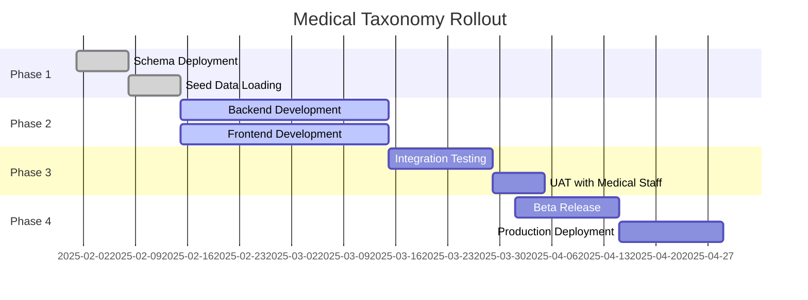

# **Medical Taxonomy Implementation Plan**
*Technical Implementation Approach and User Interface Design*

## **Executive Summary**

This document outlines the complete implementation approach for integrating the multi-dimensional medical taxonomy system into the existing video annotation tool. It provides detailed technical specifications, user interface designs, and a phased rollout strategy that maintains system stability while introducing advanced medical annotation capabilities.

---

## **🎯 Implementation Objectives**

### **Primary Goals**
1. **Seamless Integration**: Retrofit existing annotation system without breaking current functionality
2. **Progressive Enhancement**: Allow projects to opt-in to advanced medical taxonomy
3. **Backward Compatibility**: Support existing generic annotations alongside new medical taxonomy
4. **Clinical Usability**: Design interfaces optimized for medical professional workflows
5. **Performance Optimization**: Maintain real-time annotation performance with complex taxonomies

### **Success Criteria**
- Zero downtime deployment of taxonomy system
- < 50ms taxonomy lookup response times
- > 95% user satisfaction from medical professionals
- Full migration of cholecystectomy projects within 3 months

---

## **🏗️ Technical Architecture Integration**

### **Database Schema Evolution**

#### **Current Schema Preservation**
```sql
-- Preserve existing simple category system for backward compatibility
-- Keep existing tables: categories, annotations

-- Add new medical taxonomy tables alongside existing ones
CREATE TABLE taxonomy_dimensions (
    id SERIAL PRIMARY KEY,
    name VARCHAR(100) UNIQUE NOT NULL,
    display_name VARCHAR(200) NOT NULL,
    description TEXT,
    is_required BOOLEAN DEFAULT false,
    sort_order INTEGER DEFAULT 0,
    is_active BOOLEAN DEFAULT true,
    created_at TIMESTAMP WITH TIME ZONE DEFAULT NOW()
);

CREATE TABLE taxonomy_nodes (
    id SERIAL PRIMARY KEY,
    dimension_id INTEGER NOT NULL REFERENCES taxonomy_dimensions(id),
    parent_id INTEGER REFERENCES taxonomy_nodes(id),
    name VARCHAR(200) NOT NULL,
    display_name VARCHAR(300),
    snomed_code VARCHAR(50),
    level INTEGER DEFAULT 0,
    is_selectable BOOLEAN DEFAULT true,
    color VARCHAR(7),
    metadata JSONB DEFAULT '{}',
    is_active BOOLEAN DEFAULT true
);

CREATE TABLE procedure_types (
    id SERIAL PRIMARY KEY,
    name VARCHAR(200) UNIQUE NOT NULL,
    display_name VARCHAR(300),
    icd_code VARCHAR(20),
    description TEXT,
    specialty VARCHAR(100),
    default_taxonomy_config JSONB
);

-- Link projects to medical taxonomy (optional)
ALTER TABLE projects 
ADD COLUMN procedure_type_id INTEGER REFERENCES procedure_types(id),
ADD COLUMN use_medical_taxonomy BOOLEAN DEFAULT false,
ADD COLUMN taxonomy_config JSONB DEFAULT '{}';

-- Enhanced annotations with medical taxonomy support
CREATE TABLE medical_annotation_labels (
    id SERIAL PRIMARY KEY,
    annotation_id INTEGER NOT NULL REFERENCES annotations(id) ON DELETE CASCADE,
    taxonomy_node_id INTEGER NOT NULL REFERENCES taxonomy_nodes(id),
    confidence DECIMAL(3,2) DEFAULT 1.00,
    validated_by INTEGER REFERENCES users(id),
    validation_status VARCHAR(20) DEFAULT 'pending',
    clinical_notes TEXT,
    created_at TIMESTAMP WITH TIME ZONE DEFAULT NOW()
);
```

#### **Migration Strategy**
```sql
-- Gradual migration approach
-- 1. Keep existing category system active
-- 2. Allow projects to opt-in to medical taxonomy
-- 3. Provide mapping between old categories and new taxonomy nodes

CREATE TABLE category_taxonomy_mapping (
    old_category_id INTEGER REFERENCES categories(id),
    taxonomy_node_id INTEGER REFERENCES taxonomy_nodes(id),
    mapping_confidence DECIMAL(3,2) DEFAULT 1.00,
    created_by INTEGER REFERENCES users(id),
    created_at TIMESTAMP DEFAULT NOW()
);
```

---

## **🎨 User Interface Design**

### **Annotation Interface Evolution**

#### **Current Interface (Preserved)**
```typescript
// Keep existing simple category selection for backward compatibility
interface LegacyAnnotationProps {
  categories: Category[]
  selectedCategory: Category | null
  onCategorySelect: (category: Category) => void
}
```

#### **Enhanced Medical Interface**
```typescript
interface MedicalAnnotationProps {
  taxonomyConfig: TaxonomyConfiguration
  selectedLabels: Map<string, TaxonomyNode[]>
  onLabelToggle: (dimensionId: string, nodeId: string) => void
  onValidationRequest: (annotation: Annotation) => void
  clinicalMode: boolean
}

interface TaxonomyNode {
  id: string
  name: string
  displayName: string
  snomedCode?: string
  level: number
  parentId?: string
  children?: TaxonomyNode[]
  isSelectable: boolean
  color: string
  metadata: {
    clinicalSignificance: 'high' | 'medium' | 'low'
    trainingPriority: 'essential' | 'important' | 'optional'
    requiresValidation: boolean
    commonVariants: string[]
  }
}
```

### **Multi-Dimensional Annotation Panel**

#### **Tabbed Interface Design**
```tsx
const MedicalAnnotationPanel: React.FC = ({
  taxonomyConfig,
  selectedLabels,
  onLabelChange,
  clinicalMode
}) => {
  const [activeDimension, setActiveDimension] = useState('anatomical_structures')
  const [searchQuery, setSearchQuery] = useState('')
  const [showFavorites, setShowFavorites] = useState(false)

  return (
    <Box sx={{ width: '100%', height: '100%' }}>
      {/* Dimension Tabs */}
      <Tabs
        value={activeDimension}
        onChange={(e, value) => setActiveDimension(value)}
        variant="scrollable"
        scrollButtons="auto"
      >
        {taxonomyConfig.dimensions.map((dim) => (
          <Tab
            key={dim.id}
            value={dim.id}
            label={dim.displayName}
            icon={getDimensionIcon(dim.id)}
            disabled={!dim.enabled}
          />
        ))}
      </Tabs>

      {/* Search and Filters */}
      <Box sx={{ p: 1, borderBottom: 1, borderColor: 'divider' }}>
        <TextField
          size="small"
          placeholder={`Search ${taxonomyConfig.dimensions.find(d => d.id === activeDimension)?.displayName}`}
          value={searchQuery}
          onChange={(e) => setSearchQuery(e.target.value)}
          InputProps={{
            startAdornment: <SearchIcon />,
            endAdornment: (
              <IconButton onClick={() => setShowFavorites(!showFavorites)}>
                <StarIcon color={showFavorites ? 'primary' : 'disabled'} />
              </IconButton>
            )
          }}
        />
      </Box>

      {/* Taxonomy Tree */}
      <Box sx={{ flex: 1, overflow: 'auto', p: 1 }}>
        <TaxonomyTreeView
          nodes={getFilteredNodes(activeDimension, searchQuery, showFavorites)}
          selectedNodes={selectedLabels.get(activeDimension) || []}
          onNodeToggle={(nodeId) => onLabelChange(activeDimension, nodeId)}
          clinicalMode={clinicalMode}
        />
      </Box>

      {/* Selected Labels Summary */}
      <Box sx={{ p: 1, borderTop: 1, borderColor: 'divider' }}>
        <SelectedLabelsChips
          selectedLabels={selectedLabels}
          onRemove={onLabelChange}
          maxDisplay={5}
        />
      </Box>
    </Box>
  )
}
```

#### **Hierarchical Tree Component**
```tsx
const TaxonomyTreeView: React.FC = ({ nodes, selectedNodes, onNodeToggle, clinicalMode }) => {
  return (
    <TreeView
      defaultCollapseIcon={<ExpandMoreIcon />}
      defaultExpandIcon={<ChevronRightIcon />}
      multiSelect
    >
      {nodes.map((node) => (
        <TaxonomyTreeItem
          key={node.id}
          nodeId={node.id}
          node={node}
          selected={selectedNodes.some(n => n.id === node.id)}
          onToggle={onNodeToggle}
          clinicalMode={clinicalMode}
        />
      ))}
    </TreeView>
  )
}

const TaxonomyTreeItem: React.FC = ({ node, selected, onToggle, clinicalMode }) => {
  const requiresValidation = node.metadata.requiresValidation && clinicalMode
  
  return (
    <StyledTreeItem
      nodeId={node.id}
      label={
        <Box sx={{ display: 'flex', alignItems: 'center', gap: 1 }}>
          {node.isSelectable && (
            <Checkbox
              checked={selected}
              onChange={() => onToggle(node.id)}
              size="small"
              sx={{ color: node.color }}
            />
          )}
          <Box
            sx={{
              width: 12,
              height: 12,
              borderRadius: '50%',
              backgroundColor: node.color,
              opacity: selected ? 1 : 0.6
            }}
          />
          <Typography variant="body2" sx={{ fontWeight: selected ? 600 : 400 }}>
            {node.displayName}
          </Typography>
          {node.snomedCode && (
            <Chip size="small" label={node.snomedCode} variant="outlined" />
          )}
          {requiresValidation && (
            <Tooltip title="Requires clinical validation">
              <VerifiedUserIcon color="warning" fontSize="small" />
            </Tooltip>
          )}
          {node.metadata.clinicalSignificance === 'high' && (
            <PriorityHighIcon color="error" fontSize="small" />
          )}
        </Box>
      }
    >
      {node.children?.map(child => (
        <TaxonomyTreeItem
          key={child.id}
          node={child}
          selected={selectedNodes.some(n => n.id === child.id)}
          onToggle={onToggle}
          clinicalMode={clinicalMode}
        />
      ))}
    </StyledTreeItem>
  )
}
```

### **Project Configuration Interface**

#### **Enhanced Project Creation**
```tsx
const ProjectCreationForm: React.FC = () => {
  const [projectType, setProjectType] = useState<'simple' | 'medical'>('simple')
  const [procedureType, setProcedureType] = useState<ProcedureType | null>(null)
  const [taxonomyConfig, setTaxonomyConfig] = useState<TaxonomyConfiguration | null>(null)

  return (
    <Box component="form" sx={{ maxWidth: 600 }}>
      {/* Basic Project Info */}
      <TextField
        fullWidth
        label="Project Name"
        required
        sx={{ mb: 2 }}
      />
      
      <TextField
        fullWidth
        label="Description"
        multiline
        rows={3}
        sx={{ mb: 3 }}
      />

      {/* Annotation System Selection */}
      <FormControl fullWidth sx={{ mb: 3 }}>
        <FormLabel>Annotation System</FormLabel>
        <RadioGroup
          value={projectType}
          onChange={(e) => setProjectType(e.target.value as 'simple' | 'medical')}
        >
          <FormControlLabel
            value="simple"
            control={<Radio />}
            label={
              <Box>
                <Typography variant="body1">Simple Categories</Typography>
                <Typography variant="caption" color="text.secondary">
                  Traditional string-based categories (backward compatible)
                </Typography>
              </Box>
            }
          />
          <FormControlLabel
            value="medical"
            control={<Radio />}
            label={
              <Box>
                <Typography variant="body1">Medical Taxonomy</Typography>
                <Typography variant="caption" color="text.secondary">
                  Multi-dimensional clinical classification system
                </Typography>
              </Box>
            }
          />
        </RadioGroup>
      </FormControl>

      {/* Medical Taxonomy Configuration */}
      {projectType === 'medical' && (
        <Box sx={{ ml: 4, mb: 3 }}>
          <FormControl fullWidth sx={{ mb: 2 }}>
            <InputLabel>Surgical Procedure</InputLabel>
            <Select
              value={procedureType?.id || ''}
              onChange={(e) => setProcedureType(getProcedureById(e.target.value))}
            >
              <MenuItem value="laparoscopic_cholecystectomy">
                Laparoscopic Cholecystectomy
              </MenuItem>
              <MenuItem value="laparoscopic_appendectomy">
                Laparoscopic Appendectomy
              </MenuItem>
              <MenuItem value="custom">
                Custom Procedure Configuration
              </MenuItem>
            </Select>
          </FormControl>

          {procedureType && (
            <TaxonomyPreview
              config={taxonomyConfig}
              onConfigChange={setTaxonomyConfig}
            />
          )}
        </Box>
      )}

      <Box sx={{ display: 'flex', gap: 2, justifyContent: 'flex-end' }}>
        <Button variant="outlined">Cancel</Button>
        <Button variant="contained">Create Project</Button>
      </Box>
    </Box>
  )
}
```

---

## **⚡ Performance Optimization**

### **Taxonomy Caching Strategy**

#### **Frontend Caching**
```typescript
// Implement efficient taxonomy caching with React Query
const useTaxonomyConfig = (projectId: string) => {
  return useQuery({
    queryKey: ['taxonomy-config', projectId],
    queryFn: () => fetchTaxonomyConfig(projectId),
    staleTime: 10 * 60 * 1000, // 10 minutes
    cacheTime: 30 * 60 * 1000, // 30 minutes
    refetchOnWindowFocus: false
  })
}

// Lazy loading for large taxonomy trees
const useTaxonomyNodes = (dimensionId: string, parentId?: string) => {
  return useInfiniteQuery({
    queryKey: ['taxonomy-nodes', dimensionId, parentId],
    queryFn: ({ pageParam = 0 }) => 
      fetchTaxonomyNodes(dimensionId, parentId, pageParam, 50),
    getNextPageParam: (lastPage) => lastPage.nextCursor
  })
}

// Preload commonly used nodes
const TaxonomyProvider: React.FC = ({ children }) => {
  const queryClient = useQueryClient()
  
  useEffect(() => {
    // Preload essential taxonomy nodes
    const preloadNodes = async () => {
      await queryClient.prefetchQuery({
        queryKey: ['taxonomy-nodes', 'anatomical_structures'],
        queryFn: () => fetchTaxonomyNodes('anatomical_structures', null, 0, 100)
      })
    }
    
    preloadNodes()
  }, [])

  return children
}
```

#### **Backend Caching**
```python
# Redis-based taxonomy caching
class TaxonomyCache:
    def __init__(self):
        self.redis_client = redis.Redis.from_url(settings.REDIS_URL)
        self.cache_ttl = 3600  # 1 hour
    
    async def get_taxonomy_config(self, project_id: int) -> Optional[Dict]:
        cache_key = f"taxonomy_config:{project_id}"
        cached_data = await self.redis_client.get(cache_key)
        
        if cached_data:
            return json.loads(cached_data)
        
        # Fetch from database
        config = await self._fetch_config_from_db(project_id)
        
        # Cache the result
        await self.redis_client.setex(
            cache_key, 
            self.cache_ttl, 
            json.dumps(config)
        )
        
        return config
    
    async def get_taxonomy_nodes(
        self, 
        dimension_id: str, 
        parent_id: Optional[str] = None,
        limit: int = 50,
        offset: int = 0
    ) -> List[Dict]:
        cache_key = f"taxonomy_nodes:{dimension_id}:{parent_id}:{limit}:{offset}"
        cached_data = await self.redis_client.get(cache_key)
        
        if cached_data:
            return json.loads(cached_data)
        
        nodes = await self._fetch_nodes_from_db(dimension_id, parent_id, limit, offset)
        
        # Cache for shorter time since this can change more frequently
        await self.redis_client.setex(cache_key, 1800, json.dumps(nodes))
        
        return nodes
    
    async def invalidate_config_cache(self, project_id: int):
        """Invalidate cache when taxonomy configuration changes"""
        cache_pattern = f"taxonomy_config:{project_id}"
        await self.redis_client.delete(cache_pattern)
        
        # Also invalidate related node caches
        nodes_pattern = f"taxonomy_nodes:*"
        keys = await self.redis_client.keys(nodes_pattern)
        if keys:
            await self.redis_client.delete(*keys)

# FastAPI endpoint with caching
@router.get("/projects/{project_id}/taxonomy-config")
async def get_project_taxonomy_config(
    project_id: int,
    cache: TaxonomyCache = Depends(get_taxonomy_cache)
):
    config = await cache.get_taxonomy_config(project_id)
    if not config:
        raise HTTPException(status_code=404, detail="Taxonomy configuration not found")
    
    return config
```

### **Database Query Optimization**

```sql
-- Optimized indexes for taxonomy queries
CREATE INDEX CONCURRENTLY idx_taxonomy_nodes_dimension_parent_active 
ON taxonomy_nodes(dimension_id, parent_id, is_active) 
WHERE is_active = true;

CREATE INDEX CONCURRENTLY idx_taxonomy_nodes_level_selectable 
ON taxonomy_nodes(level, is_selectable) 
WHERE is_selectable = true;

CREATE INDEX CONCURRENTLY idx_medical_annotation_labels_annotation_taxonomy 
ON medical_annotation_labels(annotation_id, taxonomy_node_id);

CREATE INDEX CONCURRENTLY idx_taxonomy_nodes_metadata_gin 
ON taxonomy_nodes USING GIN(metadata);

-- Materialized view for frequently accessed taxonomy hierarchies
CREATE MATERIALIZED VIEW taxonomy_hierarchy_view AS
SELECT 
    tn.id,
    tn.dimension_id,
    tn.name,
    tn.display_name,
    tn.level,
    tn.parent_id,
    tn.color,
    tn.is_selectable,
    td.name as dimension_name,
    td.display_name as dimension_display_name,
    array_agg(child.id) as child_ids
FROM taxonomy_nodes tn
JOIN taxonomy_dimensions td ON tn.dimension_id = td.id
LEFT JOIN taxonomy_nodes child ON child.parent_id = tn.id
WHERE tn.is_active = true AND td.is_active = true
GROUP BY tn.id, td.id, td.name, td.display_name
ORDER BY td.sort_order, tn.level, tn.sort_order;

CREATE UNIQUE INDEX ON taxonomy_hierarchy_view(id);
REFRESH MATERIALIZED VIEW taxonomy_hierarchy_view;
```

---

## **🔄 Migration and Deployment Strategy**

### **Phase 1: Foundation (Weeks 1-2)**

#### **Database Migration**
```bash
# Week 1: Schema deployment
python manage.py migrate 001_add_taxonomy_tables
python manage.py migrate 002_add_project_taxonomy_fields
python manage.py migrate 003_create_indexes

# Week 2: Seed data
python manage.py loaddata medical_taxonomy_base.json
python manage.py loaddata laparoscopic_procedures.json
```

#### **Feature Flags**
```python
# Gradual rollout with feature flags
FEATURE_FLAGS = {
    'medical_taxonomy_enabled': {
        'default': False,
        'rollout_percentage': 10,  # Start with 10% of users
        'override_users': ['clinical_admin_1', 'test_surgeon_1']
    },
    'advanced_validation_rules': {
        'default': False,
        'rollout_percentage': 5
    }
}
```

### **Phase 2: Core Implementation (Weeks 3-6)**

#### **Backend API Development**
```python
# Week 3-4: Core API endpoints
/api/v1/taxonomy-dimensions/
/api/v1/taxonomy-nodes/
/api/v1/procedure-types/
/api/v1/projects/{id}/taxonomy-config

# Week 5-6: Advanced features
/api/v1/medical-annotations/
/api/v1/taxonomy-validation/
/api/v1/annotation-labels/bulk
```

#### **Frontend Component Development**
```typescript
// Week 3-4: Core components
- TaxonomyTreeView
- MedicalAnnotationPanel
- ProjectConfigurationForm

// Week 5-6: Advanced components  
- ValidationRuleEditor
- TaxonomyAnalytics
- BulkAnnotationTools
```

### **Phase 3: Integration Testing (Weeks 7-8)**

#### **Testing Strategy**
```yaml
Unit Tests:
  - Taxonomy node CRUD operations
  - Validation rule engine
  - Cache invalidation logic
  - API endpoint responses

Integration Tests:
  - End-to-end annotation workflow
  - Project migration scenarios
  - Multi-user collaboration
  - Performance under load

User Acceptance Testing:
  - Medical professional usability
  - Annotation accuracy validation
  - Configuration management workflow
```

### **Phase 4: Production Rollout (Weeks 9-12)**

#### **Rollout Schedule**


---

## **👥 User Training and Documentation**

### **Training Program Structure**

#### **Medical Professionals**
```yaml
Basic Training (2 hours):
  - Introduction to multi-dimensional taxonomy
  - Hands-on annotation practice
  - Quality validation workflow

Advanced Training (4 hours):
  - Configuration management
  - Validation rule creation
  - Analytics and reporting

Ongoing Support:
  - Weekly office hours
  - Video tutorial library
  - Peer mentoring program
```

#### **Technical Annotators**
```yaml
Medical Terminology Training (6 hours):
  - Basic laparoscopic anatomy
  - Surgical instrument identification
  - Pathological condition recognition

System Training (3 hours):
  - New annotation interface
  - Quality control processes
  - Error reporting procedures
```

### **Documentation Suite**

#### **User Guides**
- **Quick Start Guide**: 5-minute annotation workflow overview
- **Comprehensive Manual**: Complete feature documentation
- **Video Tutorials**: Step-by-step visual guides
- **FAQ Database**: Common questions and troubleshooting

#### **Administrative Documentation**
- **Configuration Guide**: Taxonomy management procedures
- **Integration Manual**: API documentation for developers
- **Compliance Checklist**: Medical regulation requirements
- **Performance Monitoring**: System health and usage analytics

---

## **📊 Quality Assurance Framework**

### **Validation Levels**

#### **Automated Validation**
```python
class TaxonomyValidator:
    def validate_annotation_labels(self, labels: List[AnnotationLabel]) -> ValidationResult:
        """Multi-level validation for annotation quality"""
        errors = []
        warnings = []
        
        # Level 1: Structural validation
        for label in labels:
            if not self._validate_node_exists(label.taxonomy_node_id):
                errors.append(f"Invalid taxonomy node: {label.taxonomy_node_id}")
            
            if not self._validate_confidence_range(label.confidence):
                warnings.append(f"Confidence out of range: {label.confidence}")
        
        # Level 2: Clinical consistency
        anatomical_labels = [l for l in labels if l.dimension == 'anatomical_structures']
        pathology_labels = [l for l in labels if l.dimension == 'pathological_conditions']
        
        if not self._validate_anatomy_pathology_consistency(anatomical_labels, pathology_labels):
            errors.append("Anatomical and pathological labels are inconsistent")
        
        # Level 3: Temporal consistency (if applicable)
        if self._has_temporal_context(labels):
            if not self._validate_temporal_consistency(labels):
                warnings.append("Temporal inconsistency detected")
        
        return ValidationResult(errors=errors, warnings=warnings)
    
    def _validate_anatomy_pathology_consistency(self, anatomy, pathology) -> bool:
        """Validate that pathological conditions match anatomical structures"""
        for path_label in pathology:
            compatible_anatomy = self._get_compatible_anatomy(path_label.taxonomy_node_id)
            if not any(a.taxonomy_node_id in compatible_anatomy for a in anatomy):
                return False
        return True
```

#### **Clinical Review Workflow**
```python
class ClinicalReviewService:
    def queue_for_review(self, annotation_id: int, review_type: str = 'standard'):
        """Queue annotation for clinical expert review"""
        review = ClinicalReview(
            annotation_id=annotation_id,
            review_type=review_type,
            status='pending',
            assigned_to=self._assign_reviewer(review_type),
            priority=self._calculate_priority(annotation_id)
        )
        
        # Send notification to assigned reviewer
        self._notify_reviewer(review.assigned_to, review)
        
        return review
    
    def _assign_reviewer(self, review_type: str) -> int:
        """Assign reviewer based on expertise and workload"""
        if review_type == 'pathology':
            return self._get_pathologist_with_lowest_queue()
        elif review_type == 'instruments':
            return self._get_surgeon_with_instrument_expertise()
        else:
            return self._get_general_surgical_reviewer()
```

---

## **🎯 Success Metrics and Monitoring**

### **Performance Metrics**

#### **System Performance**
```python
# Real-time performance monitoring
PERFORMANCE_TARGETS = {
    'taxonomy_lookup_time': 50,  # milliseconds
    'annotation_save_time': 200,  # milliseconds
    'configuration_load_time': 500,  # milliseconds
    'validation_processing_time': 100,  # milliseconds
}

# Monitoring dashboard metrics
class PerformanceMonitor:
    def track_annotation_time(self, user_id: int, start_time: float, end_time: float):
        duration = end_time - start_time
        
        # Log to metrics system
        self.metrics_client.histogram(
            'annotation_duration_seconds',
            duration,
            tags={'user_type': self._get_user_type(user_id)}
        )
        
        # Alert if performance degrades
        if duration > PERFORMANCE_TARGETS['annotation_save_time'] / 1000:
            self._alert_performance_issue('annotation_slow', user_id, duration)
```

#### **Clinical Quality Metrics**
```python
class QualityMetrics:
    def calculate_inter_annotator_agreement(self, annotation_batch_id: int) -> float:
        """Calculate Cohen's kappa for annotation consistency"""
        annotations = self._get_batch_annotations(annotation_batch_id)
        
        # Group annotations by frame and calculate agreement
        agreement_scores = []
        for frame_group in self._group_by_frame(annotations):
            if len(frame_group) >= 2:
                score = self._calculate_kappa(frame_group)
                agreement_scores.append(score)
        
        return np.mean(agreement_scores) if agreement_scores else 0.0
    
    def track_clinical_accuracy(self, annotation_id: int, expert_validation: bool):
        """Track accuracy of annotations against expert review"""
        accuracy_rate = self._calculate_rolling_accuracy(annotation_id)
        
        # Update user performance scores
        self._update_annotator_score(annotation_id, expert_validation)
        
        # Alert if accuracy drops below threshold
        if accuracy_rate < 0.85:
            self._trigger_additional_training(annotation_id)
```

---

## **🚀 Deployment Checklist**

### **Pre-Deployment Validation**

#### **Technical Readiness**
- [ ] Database migrations tested on staging environment
- [ ] API endpoints performance tested with load simulation
- [ ] Frontend components tested across browsers and devices
- [ ] Cache invalidation strategies verified
- [ ] Backup and rollback procedures documented

#### **Clinical Readiness**
- [ ] Medical taxonomy reviewed and approved by clinical experts
- [ ] Validation rules tested with real surgical video data
- [ ] User training materials completed and reviewed
- [ ] Inter-annotator agreement studies completed
- [ ] Clinical workflow integration tested

#### **Operational Readiness**
- [ ] Monitoring dashboards configured
- [ ] Alert thresholds set for performance and quality metrics
- [ ] Support documentation completed
- [ ] Escalation procedures defined
- [ ] Compliance requirements validated

### **Go-Live Activities**
```bash
# Deployment sequence
1. Deploy database migrations during maintenance window
2. Deploy backend services with feature flags disabled
3. Deploy frontend with progressive rollout
4. Enable feature flags for pilot users (5%)
5. Monitor metrics for 24 hours
6. Gradually increase rollout percentage (10% → 25% → 50% → 100%)
7. Full production release with monitoring
```

---

## **📚 Supporting Resources**

### **Documentation Deliverables**
- **Technical Specifications**: Complete API documentation and database schema
- **User Training Materials**: Video tutorials, quick reference guides, and interactive demos
- **Clinical Guidelines**: Best practices for medical annotation and taxonomy management
- **Administrative Procedures**: Configuration management, user role assignment, and quality control

### **Ongoing Support Structure**
- **Technical Support**: 24/7 system monitoring and incident response
- **Clinical Support**: Regular office hours with medical informatics experts
- **User Community**: Forums for peer support and feature requests
- **Continuous Improvement**: Monthly feedback sessions and quarterly feature reviews

This implementation plan provides a comprehensive roadmap for successfully integrating advanced medical taxonomy capabilities into the existing video annotation tool while maintaining system stability and ensuring clinical accuracy.