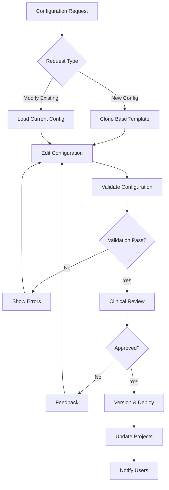

# **Medical Taxonomy Configuration System**
*Extensible and User-Friendly Management Interface*

## **Executive Summary**

This document outlines the configuration system for managing medical taxonomies in the video annotation tool. The system enables medical professionals to create, modify, and maintain complex multi-dimensional taxonomies without requiring technical expertise, while ensuring clinical accuracy and consistency.

---

## **🎯 System Objectives**

### **Primary Goals**
1. **Non-Technical Management**: Enable medical professionals to manage taxonomies through intuitive interfaces
2. **Multi-Institutional Support**: Allow different hospitals/programs to customize taxonomies for their specific needs
3. **Version Control**: Track taxonomy changes with rollback capabilities
4. **Validation Framework**: Ensure clinical accuracy through built-in validation rules
5. **Import/Export Capability**: Support standard medical terminology imports (SNOMED CT, ICD-11)

### **Key Requirements**
- **Extensibility**: Easy addition of new dimensions, categories, and hierarchies
- **Flexibility**: Support for procedure-specific and institution-specific customizations
- **Audit Trail**: Complete tracking of who made what changes and when
- **Clinical Validation**: Multi-level review process for taxonomy modifications
- **Performance**: Fast lookup and filtering for real-time annotation

---

## **🏗️ System Architecture**

### **Configuration Layers**

```
┌─────────────────────────────────────────┐
│           Global Base Taxonomy           │  ← Master medical taxonomy
├─────────────────────────────────────────┤
│        Procedure-Specific Templates     │  ← Cholecystectomy, Appendectomy, etc.
├─────────────────────────────────────────┤
│       Institution Customizations       │  ← Hospital-specific additions
├─────────────────────────────────────────┤
│         Project-Level Overrides        │  ← Research project modifications
└─────────────────────────────────────────┘
```

### **Configuration Hierarchy**
1. **Global Base**: Standard medical taxonomy (maintained by clinical experts)
2. **Procedure Templates**: Procedure-specific subsets and additions
3. **Institution Layer**: Hospital/program-specific customizations
4. **Project Layer**: Individual research project modifications

---

## **📊 Configuration Data Model**

### **Taxonomy Configuration Schema**

```json
{
  "configuration_metadata": {
    "id": "laparoscopic_cholecystectomy_v2.1",
    "name": "Laparoscopic Cholecystectomy Taxonomy",
    "version": "2.1.0",
    "description": "Standard taxonomy for laparoscopic gallbladder surgery",
    "created_by": "dr_smith_surgeon_id",
    "created_at": "2025-01-15T10:30:00Z",
    "approved_by": ["dr_jones_id", "dr_wilson_id"],
    "approval_date": "2025-01-20T14:15:00Z",
    "status": "active",
    "parent_config_id": "global_laparoscopic_base_v1.5",
    "institution_id": "mayo_clinic_surgery_dept",
    "procedure_types": ["laparoscopic_cholecystectomy"],
    "clinical_specialty": "general_surgery"
  },
  
  "dimensions_config": {
    "anatomical_structures": {
      "enabled": true,
      "required": true,
      "display_name": "Anatomical Structures",
      "description": "Organs, vessels, and tissue structures",
      "max_selections": null,
      "validation_rules": ["anatomical_consistency", "spatial_constraints"],
      "custom_properties": {
        "color_coding": "anatomy_standard",
        "confidence_required": true,
        "expert_validation": "required_for_complex"
      }
    },
    "surgical_instruments": {
      "enabled": true,
      "required": false,
      "display_name": "Surgical Instruments",
      "description": "Tools and devices in use",
      "max_selections": 3,
      "validation_rules": ["instrument_compatibility"],
      "custom_properties": {
        "track_energy_state": true,
        "require_usage_context": false
      }
    },
    "pathological_conditions": {
      "enabled": true,
      "required": false,
      "display_name": "Pathological Findings",
      "description": "Disease states and complications",
      "max_selections": null,
      "validation_rules": ["pathology_anatomy_consistency"],
      "custom_properties": {
        "severity_grading": true,
        "differential_diagnosis": true,
        "expert_validation": "always_required"
      }
    }
  },

  "taxonomy_nodes": {
    "anatomical_structures": {
      "hepatobiliary_system": {
        "id": "anat_hepatobiliary_sys",
        "display_name": "Hepatobiliary System",
        "code": "SCTID:17786009",
        "level": 0,
        "parent_id": null,
        "is_selectable": false,
        "color": "#4CAF50",
        "description": "Liver, gallbladder, and biliary tree",
        "metadata": {
          "clinical_significance": "high",
          "training_priority": "essential",
          "common_variants": []
        },
        "children": {
          "liver": {
            "id": "anat_liver",
            "display_name": "Liver",
            "code": "SCTID:10200004",
            "level": 1,
            "parent_id": "anat_hepatobiliary_sys",
            "is_selectable": true,
            "color": "#8BC34A",
            "children": {
              "right_lobe": {
                "id": "anat_liver_right_lobe",
                "display_name": "Right Hepatic Lobe",
                "code": "SCTID:66480008",
                "level": 2,
                "parent_id": "anat_liver",
                "is_selectable": true,
                "color": "#9CCC65"
              },
              "left_lobe": {
                "id": "anat_liver_left_lobe",
                "display_name": "Left Hepatic Lobe", 
                "code": "SCTID:43119004",
                "level": 2,
                "parent_id": "anat_liver",
                "is_selectable": true,
                "color": "#AED581"
              }
            }
          },
          "gallbladder": {
            "id": "anat_gallbladder",
            "display_name": "Gallbladder",
            "code": "SCTID:28231008",
            "level": 1,
            "parent_id": "anat_hepatobiliary_sys",
            "is_selectable": true,
            "color": "#66BB6A",
            "children": {
              "fundus": {
                "id": "anat_gb_fundus",
                "display_name": "Gallbladder Fundus",
                "code": "SCTID:59471005",
                "level": 2,
                "parent_id": "anat_gallbladder",
                "is_selectable": true,
                "color": "#81C784"
              },
              "body": {
                "id": "anat_gb_body",
                "display_name": "Gallbladder Body",
                "code": "SCTID:71753006",
                "level": 2,
                "parent_id": "anat_gallbladder",
                "is_selectable": true,
                "color": "#A5D6A7"
              },
              "neck": {
                "id": "anat_gb_neck",
                "display_name": "Gallbladder Neck",
                "code": "SCTID:37765009",
                "level": 2,
                "parent_id": "anat_gallbladder",
                "is_selectable": true,
                "color": "#C8E6C9"
              }
            }
          }
        }
      }
    }
  },

  "validation_rules": {
    "anatomical_consistency": {
      "type": "mutual_exclusion",
      "description": "Prevent selection of anatomically incompatible structures",
      "rules": [
        {
          "condition": "if_selected",
          "node_id": "anat_gb_acute_cholecystitis",
          "then_prevent": ["anat_gb_normal_healthy"],
          "message": "Cannot label as both inflamed and healthy"
        }
      ]
    },
    "spatial_constraints": {
      "type": "spatial_relationship",
      "description": "Enforce anatomical spatial relationships",
      "rules": [
        {
          "parent": "anat_gallbladder",
          "must_contain": ["anat_gb_fundus", "anat_gb_body", "anat_gb_neck"],
          "message": "Gallbladder regions must be within gallbladder boundary"
        }
      ]
    }
  },

  "user_interface_config": {
    "annotation_panel_layout": "multi_tab",
    "default_dimension_order": ["anatomical_structures", "surgical_instruments", "pathological_conditions"],
    "quick_select_favorites": ["anat_gallbladder", "instr_monopolar_hook", "path_acute_cholecystitis"],
    "color_scheme": "medical_standard",
    "keyboard_shortcuts": {
      "toggle_dimension": "Tab",
      "confirm_selection": "Enter",
      "clear_selections": "Escape"
    }
  }
}
```

---

## **🛠️ Configuration Management Interface**

### **Web-Based Configuration Builder**

#### **1. Taxonomy Structure Editor**
```
┌─────────────────────────────────────────────────────────┐
│  Taxonomy Configuration Builder                         │
├─────────────────────────────────────────────────────────┤
│  📁 Anatomical Structures                              │
│    ├── 📁 Hepatobiliary System                        │
│    │     ├── 🏷️ Liver                                  │
│    │     │     ├── 🏷️ Right Lobe               [Edit] │
│    │     │     └── 🏷️ Left Lobe                [Edit] │
│    │     └── 🏷️ Gallbladder                           │
│    │           ├── 🏷️ Fundus                  [Edit] │
│    │           ├── 🏷️ Body                    [Edit] │
│    │           └── 🏷️ Neck                    [Edit] │
│    └── [+ Add New Structure]                           │
│                                                         │
│  📁 Surgical Instruments                               │
│    ├── 📁 Energy Devices                              │
│    │     ├── 🏷️ Monopolar Hook                [Edit] │
│    │     └── 🏷️ Bipolar Forceps              [Edit] │
│    └── [+ Add New Instrument]                          │
└─────────────────────────────────────────────────────────┘
```

#### **2. Node Properties Panel**
```
┌─────────────────────────────────────────────────────────┐
│  Edit: Gallbladder Fundus                              │
├─────────────────────────────────────────────────────────┤
│  Display Name: [Gallbladder Fundus              ]     │
│  SNOMED Code:  [59471005                        ]     │
│  Description:  [Dome-shaped bottom portion...   ]     │
│  Color:        [🔴] #81C784                           │
│  Level:        [2] (Auto-calculated)                   │
│                                                         │
│  Clinical Properties:                                   │
│  ☑️ Can be annotated directly                         │
│  ☑️ Requires expert validation                        │
│  ☐ Training priority: Essential                       │
│  ☐ Common anatomical variant                          │
│                                                         │
│  Validation Rules:                                      │
│  ☑️ Must be within gallbladder boundary               │
│  ☑️ Cannot coexist with "absent gallbladder"          │
│                                                         │
│  [Save Changes] [Cancel] [Delete Node]                 │
└─────────────────────────────────────────────────────────┘
```

#### **3. Validation Rules Editor**
```
┌─────────────────────────────────────────────────────────┐
│  Validation Rules Configuration                         │
├─────────────────────────────────────────────────────────┤
│  Rule Type: [Mutual Exclusion        ▼]               │
│  Rule Name: [Cholecystitis States    ]                │
│                                                         │
│  IF node selected:                                      │
│  [Acute Cholecystitis           ▼]                    │
│                                                         │
│  THEN prevent selection of:                            │
│  • Normal Gallbladder           [Remove]               │
│  • Chronic Cholecystitis        [Remove]               │
│  [+ Add Exclusion]                                     │
│                                                         │
│  Error Message:                                         │
│  [Cannot select conflicting pathological states]       │
│                                                         │
│  [Save Rule] [Test Rule] [Cancel]                      │
└─────────────────────────────────────────────────────────┘
```

---

## **⚙️ Configuration Workflow**

### **Creation and Modification Process**



### **Version Control System**

```json
{
  "version_history": {
    "v2.1.0": {
      "created_date": "2025-01-20T14:15:00Z",
      "created_by": "dr_smith_surgeon_id",
      "status": "active",
      "change_summary": "Added gallbladder inflammation subcategories",
      "changes": [
        {
          "type": "add_node",
          "dimension": "pathological_conditions",
          "node_path": "inflammation.acute_cholecystitis.empyema",
          "description": "Added empyema as severe cholecystitis subtype"
        }
      ],
      "clinical_approval": {
        "approved_by": ["dr_jones_id", "dr_wilson_id"],
        "approval_date": "2025-01-20T14:15:00Z",
        "approval_notes": "Clinically accurate addition, important for training data"
      }
    },
    "v2.0.1": {
      "created_date": "2025-01-15T09:30:00Z",
      "created_by": "dr_adams_resident_id", 
      "status": "superseded",
      "change_summary": "Fixed instrument categorization",
      "rollback_reason": "Missing clinical validation"
    }
  }
}
```

---

## **🔧 Technical Implementation**

### **Configuration Storage Strategy**

#### **Database Schema**
```sql
-- Taxonomy configurations
CREATE TABLE taxonomy_configurations (
    id SERIAL PRIMARY KEY,
    name VARCHAR(200) NOT NULL,
    version VARCHAR(20) NOT NULL,
    description TEXT,
    config_data JSONB NOT NULL,
    parent_config_id INTEGER REFERENCES taxonomy_configurations(id),
    institution_id INTEGER REFERENCES institutions(id),
    created_by INTEGER REFERENCES users(id),
    approved_by INTEGER[],
    status VARCHAR(20) DEFAULT 'draft',
    created_at TIMESTAMP DEFAULT NOW(),
    updated_at TIMESTAMP DEFAULT NOW(),
    
    UNIQUE(name, version)
);

-- Configuration change log
CREATE TABLE configuration_changes (
    id SERIAL PRIMARY KEY,
    config_id INTEGER REFERENCES taxonomy_configurations(id),
    change_type VARCHAR(50), -- 'add_node', 'modify_node', 'delete_node', 'add_rule'
    change_data JSONB NOT NULL,
    changed_by INTEGER REFERENCES users(id),
    change_timestamp TIMESTAMP DEFAULT NOW()
);

-- Project configuration assignments
CREATE TABLE project_taxonomy_assignments (
    project_id INTEGER REFERENCES projects(id),
    config_id INTEGER REFERENCES taxonomy_configurations(id),
    assigned_at TIMESTAMP DEFAULT NOW(),
    assigned_by INTEGER REFERENCES users(id),
    
    PRIMARY KEY(project_id, config_id)
);
```

#### **API Endpoints**

```yaml
Configuration Management API:

GET /api/v1/taxonomy-configs
  - List available configurations
  - Filter by institution, procedure, status

POST /api/v1/taxonomy-configs  
  - Create new configuration
  - Include validation and approval workflow

GET /api/v1/taxonomy-configs/{id}
  - Retrieve specific configuration
  - Include full taxonomy tree

PUT /api/v1/taxonomy-configs/{id}
  - Update configuration
  - Trigger validation and review process

POST /api/v1/taxonomy-configs/{id}/validate
  - Validate configuration changes
  - Check clinical rules and consistency

POST /api/v1/taxonomy-configs/{id}/approve
  - Clinical approval workflow
  - Require appropriate permissions

GET /api/v1/taxonomy-configs/{id}/versions
  - Version history and changes
  - Support rollback operations

POST /api/v1/taxonomy-configs/import
  - Import from SNOMED CT, ICD-11
  - Map to internal taxonomy structure
```

---

## **🎯 User Roles and Permissions**

### **Role-Based Access Control**

```yaml
Clinical Administrator:
  - Create/modify global taxonomy templates
  - Approve institutional configurations
  - Manage user permissions
  - Access all audit trails

Senior Surgeon:
  - Review and approve clinical configurations
  - Create procedure-specific templates
  - Validate new taxonomy additions
  - Override validation rules (with justification)

Medical Informaticist:
  - Import/export standard terminologies
  - Configure validation rules
  - Manage technical integrations
  - System performance optimization

Project Manager:
  - Assign configurations to projects
  - Modify project-specific taxonomies
  - Monitor annotation quality
  - Generate compliance reports

Annotator (Medical Professional):
  - View assigned taxonomy
  - Suggest additions/modifications
  - Report taxonomy issues
  - Access training materials

Annotator (Technical):
  - View assigned taxonomy
  - Report technical issues
  - Request training on medical terms
  - Limited modification permissions
```

---

## **📊 Configuration Analytics**

### **Usage Monitoring**

```json
{
  "configuration_metrics": {
    "config_id": "laparoscopic_cholecystectomy_v2.1",
    "usage_statistics": {
      "active_projects": 15,
      "total_annotations": 12847,
      "unique_annotators": 23,
      "annotation_completion_rate": 0.94
    },
    "taxonomy_usage": {
      "most_used_nodes": [
        {"node_id": "anat_gallbladder", "usage_count": 3421},
        {"node_id": "instr_monopolar_hook", "usage_count": 2876},
        {"node_id": "path_acute_cholecystitis", "usage_count": 1954}
      ],
      "unused_nodes": [
        {"node_id": "path_empyema", "reason": "rare_condition"},
        {"node_id": "anat_accessory_vessel", "reason": "anatomical_variant"}
      ]
    },
    "quality_metrics": {
      "inter_annotator_agreement": 0.87,
      "validation_rule_triggers": 234,
      "clinical_review_rate": 0.15
    },
    "performance_impact": {
      "average_annotation_time": "2.3_minutes",
      "taxonomy_lookup_time": "45_milliseconds",
      "user_error_rate": 0.03
    }
  }
}
```

---

## **🚀 Implementation Roadmap**

### **Phase 1: Core Configuration System (Month 1)**
- Database schema implementation
- Basic CRUD API endpoints
- Simple web-based configuration editor
- Version control foundation

### **Phase 2: Advanced Features (Month 2)**
- Validation rule engine
- Clinical approval workflows
- Import/export functionality
- User role management

### **Phase 3: User Interface Enhancement (Month 3)**
- Intuitive drag-and-drop taxonomy editor
- Real-time validation feedback
- Configuration preview and testing
- Mobile-responsive design

### **Phase 4: Integration and Optimization (Month 4)**
- Project assignment automation
- Performance optimization
- Analytics dashboard
- Training materials and documentation

---

## **📋 Testing and Validation**

### **Configuration Testing Protocol**

1. **Structural Validation**
   - Taxonomy hierarchy integrity
   - Node relationship consistency
   - Circular reference detection

2. **Clinical Validation**
   - Medical accuracy verification
   - Terminology standard compliance
   - Expert review requirements

3. **Performance Testing**
   - Large taxonomy loading times
   - Real-time annotation responsiveness
   - Concurrent user support

4. **User Acceptance Testing**
   - Medical professional usability
   - Configuration workflow efficiency
   - Error handling and recovery

---

## **🎯 Success Metrics**

### **Technical Metrics**
- Configuration creation time: < 2 hours for standard procedures
- Taxonomy lookup performance: < 50ms average response
- System uptime: > 99.5% availability

### **Clinical Metrics** 
- Medical professional adoption rate: > 80%
- Inter-annotator agreement improvement: > 15%
- Clinical validation efficiency: 50% faster review process

### **Usability Metrics**
- User satisfaction score: > 4.5/5
- Training time reduction: 40% faster onboarding
- Configuration error rate: < 2% of modifications

---

## **📚 Supporting Documentation**

- **User Manuals**: Step-by-step configuration guides for medical professionals
- **Technical Specifications**: API documentation and integration guides  
- **Clinical Guidelines**: Best practices for medical taxonomy management
- **Training Materials**: Video tutorials and interactive learning modules

This configuration system provides the flexibility and clinical accuracy needed to support diverse medical institutions while maintaining the standardization required for effective AI model training.